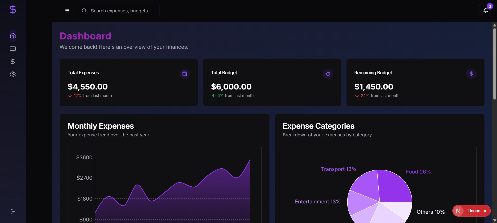
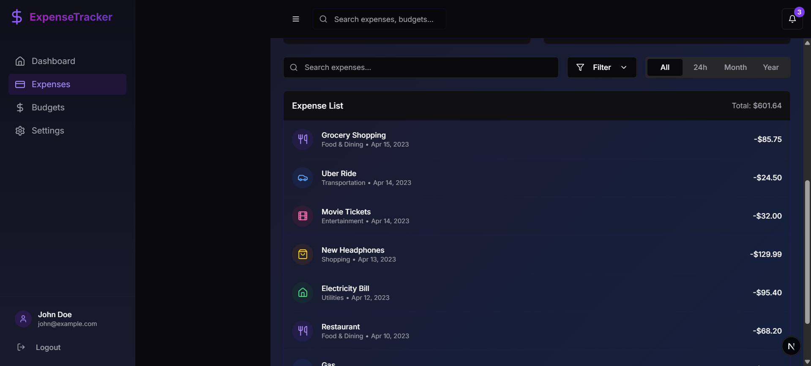
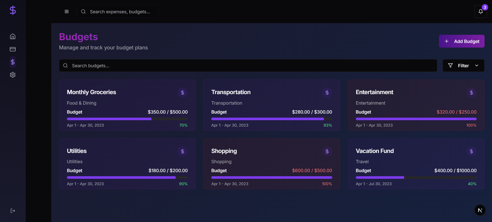
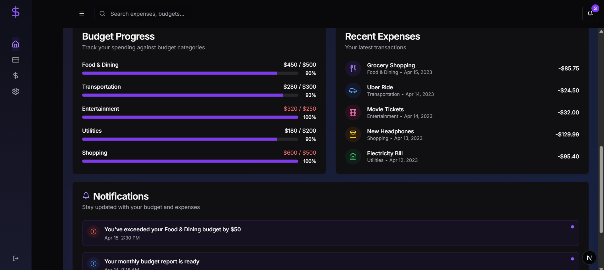
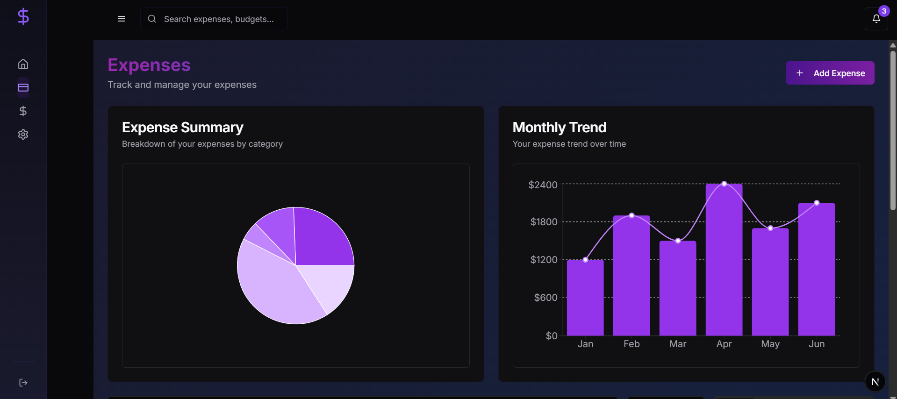

# Personal Expense Tracker (Frontend)

## Overview
The **Personal Expense Tracker** is a web application designed to help users manage their expenses efficiently. It provides an intuitive interface to track expenses, create and manage budgets, and receive notifications when spending limits are exceeded.

## Features
- **User Authentication**: Signup and Signin functionality.
- **Dashboard**: Overview of expenses and budgets.
- **Expense Management**: Add, edit, and delete expenses.
- **Budget Management**: Create and track budgets.
- **Notifications**: Alerts when budget limits are exceeded.

## Tech Stack
- **Framework**: Next.js (TypeScript)
- **Styling**: Tailwind CSS

## Installation & Setup
1. Clone the repository:
   ```sh
   git clone https://github.com/anubhabnath098/personal-expense-tracker-frontend.git
   ```
2. Navigate to the project directory:
   ```sh
   cd personal-expense-tracker-frontend
   ```
3. Install dependencies:
   ```sh
   npm install
   ```
4. Start the development server:
   ```sh
   npm run dev
   ```

## Screenshots

### Dashboard View



### Expense List



### Budget Management


### Dashboard Summary


### Expense management



## Contributing
Contributions are welcome! Feel free to fork the repo and submit a pull request.

## License
This project is licensed under the MIT License.

