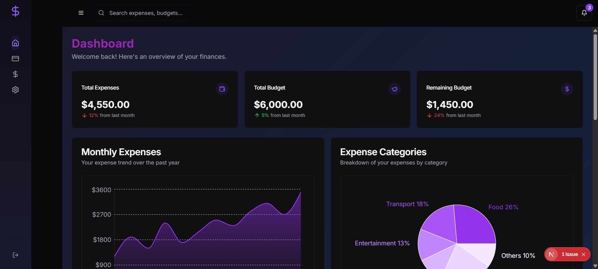
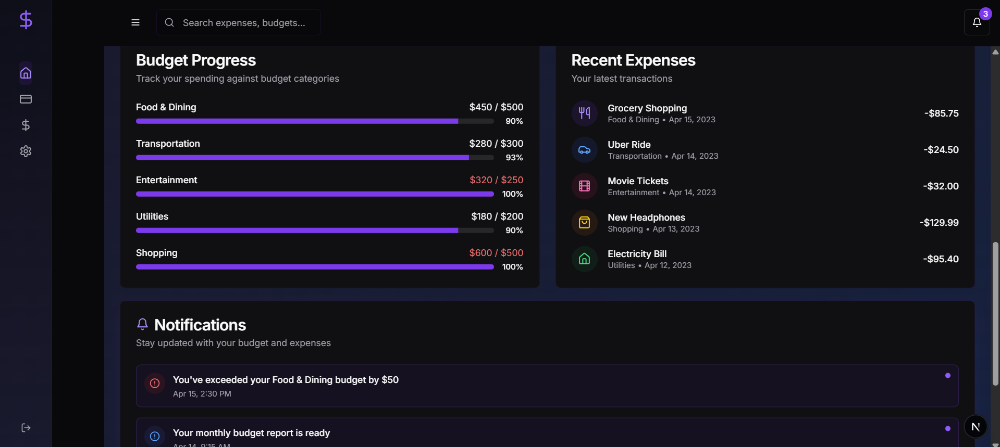

# Personal Expense Tracker 💸

A full-stack web application to track personal expenses and budgets, featuring user authentication, expense management, budget planning, and notification features. 📊

## Tech Stack 🛠️

**Frontend:** Next.js, Tailwind CSS, TypeScript
**Backend:** Express.js, Node.js, JavaScript
**Database:** MySQL

## Project Structure 📂

```
personal-expense-tracker/
├── frontend/
│   └── .env.local
├── backend/
│   └── .env
└── README.md
```

## Backend Setup ⚙️

### 1️⃣ Prerequisites

* Node.js (v18 or higher)
* MySQL (v8 or higher)
* npm (v9 or higher)

### 2️⃣ Install Dependencies 📦

```bash
cd backend
npm install
```

### 3️⃣ Configure Environment Variables 🔧

Create a `.env` file in the backend folder and add:

```env
PORT='5000'
JWT_SECRET_KEY='your_jwt_secret_key'
FRONTEND_URL='http://localhost:3000'
MYSQL_DB_HOST='127.0.0.1'
MYSQL_DB_USER='your_mysql_user'
MYSQL_DB_PASSWORD='your_mysql_password'
MYSQL_DB_NAME='personal_expense_tracker'
EMAIL_SENDER='your_email@example.com'
EMAIL_PASSWORD='your_email_password'
```

### 4️⃣ Create Database Tables 🗒️

```bash
npm run create-table
```

### 5️⃣ Start the Server 🚀

Development Mode (with auto-reload using nodemon):

```bash
npm run dev
```

Production Mode:

```bash
npm run start
```

The server will run at `http://localhost:5000`.

---

## Backend API Endpoints 📡

### User Routes 👤

| Method | Endpoint                           | Middleware     | Description                 |
| ------ | ---------------------------------- | -------------- | --------------------------- |
| GET    | /api/users/me                      | authMiddleware | Get current user details    |
| PUT    | /api/users/update                  | authMiddleware | Update user profile         |
| POST   | /api/users/send-email-update-otp   | None           | Send OTP for email update   |
| POST   | /api/users/verify-email-update-otp | None           | Verify OTP for email update |

### Expense Routes 💰

| Method | Endpoint                          | Middleware     | Description                    |
| ------ | --------------------------------- | -------------- | ------------------------------ |
| GET    | /api/expenses/all/\:userid        | authMiddleware | Get all expenses for a user    |
| POST   | /api/expenses/add                 | authMiddleware | Add a new expense              |
| PUT    | /api/expenses/update/\:id         | authMiddleware | Update an expense by ID        |
| DELETE | /api/expenses/delete/\:id         | authMiddleware | Delete an expense by ID        |
| GET    | /api/expenses/recent/\:userid     | authMiddleware | Get recent expenses for a user |
| GET    | /api/expenses/monthly/\:userid    | authMiddleware | Get monthly expenses           |
| GET    | /api/expenses/categories/\:userid | authMiddleware | Get expense categories         |
| GET    | /api/expenses/total/\:userid      | authMiddleware | Get total expenses for a user  |
| GET    | /api/expenses/\:id                | authMiddleware | Get expense by ID              |
| GET    | /api/expenses/budget/all/\:id         | authMiddleware | Get all budget names with id   |

### Budget Routes 📈

| Method | Endpoint                                     | Middleware     | Description                    |
| ------ | -------------------------------------------- | -------------- | ------------------------------ |
| GET    | /api/budgets/all/\:userid                    | authMiddleware | Get all budgets for a user     |
| POST   | /api/budgets/add                             | authMiddleware | Add a new budget               |
| PUT    | /api/budgets/update/\:id                     | authMiddleware | Update a budget by ID          |
| DELETE | /api/budgets/delete/\:id                     | authMiddleware | Delete a budget by ID          |
| GET    | /api/budgets/summary/\:userid                | authMiddleware | Get budget summary by category |
| GET    | /api/budgets/total/\:userid                  | authMiddleware | Get total budget               |
| GET    | /api/budgets/remaining/\:userid              | authMiddleware | Get remaining budget           |
| GET    | /api/budgets/notifications/unread/\:user\_id | authMiddleware | Get unread notifications       |
| GET    | /api/budgets/notifications/recent/\:user\_id | authMiddleware | Get recent notifications       |
| POST   | /api/budgets/notifications/read              | authMiddleware | Mark notification as read      |
| GET    | /api/budgets/\:id                            | authMiddleware | Get budget by ID               |

### Auth Routes 🔐

| Method | Endpoint             | Middleware      | Description               |
| ------ | -------------------- | --------------- | ------------------------- |
| POST   | /api/auth/sign-up    | None            | User sign-up              |
| POST   | /api/auth/sign-in    | None            | User sign-in              |
| POST   | /api/auth/send-otp   | None            | Send OTP for verification |
| POST   | /api/auth/verify-otp | None            | Verify OTP                |
| GET    | /api/auth/users      | adminMiddleware | Get all users (admin)     |
| GET    | /api/auth/users/\:id | authMiddleware  | Get user details by ID    |

---

## Relational Schema Diagram   


## Frontend Setup 🌟

### 1️⃣ Prerequisites

* Node.js (v18 or higher)
* npm (v9 or higher)

### 2️⃣ Install Dependencies 📦

```bash
cd frontend
npm install
```

### 3️⃣ Configure Environment Variables 🔧

Create a `.env.local` file in the frontend folder and add:

```env
NEXT_PUBLIC_BACKEND_URL='http://localhost:5000'
```

### 4️⃣ Start the Frontend 🚀

```bash
npm run dev
```

The frontend will be available at `http://localhost:3000`.

---

## Screenshots 📸

### 1. Homepage


### 2. Dashboard



### 3. Expenses Page


### 4. Budget Page


### 5. Expenses Summary and Budget Report



### 6. Mobile View 📱

<p align="center">
  
  
  
  
</p>
